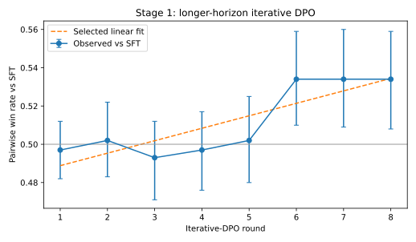
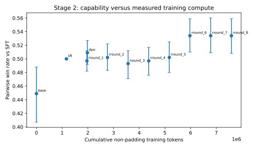
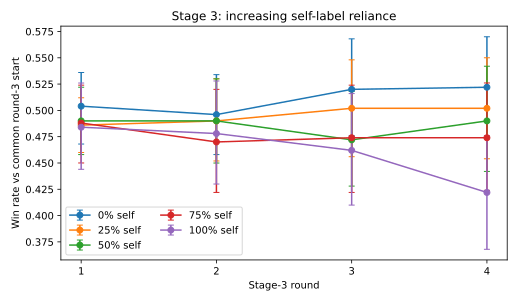

# Recursive Self-Improvement Study

This extension replaces the repository's unsupported illustrative iterative-DPO
figures with an artifact-backed GPT-2-medium study. The primary checkpoint
family is deliberately limited to base, SFT, DPO, and iterative-DPO rounds
1–8. Existing Qwen PPO/GRPO artifacts remain valid within their own experiment
but are excluded from the shared capability–compute curve.

The complete design and decision rules are frozen in `preregistration.md` and
`study_config.json`. No result is claimed until raw example-level evaluations,
checkpoint hashes, training-token accounting, environment manifests, and the
generated statistical report exist.

## Study structure

1. Materialize and validate the GPT-2-medium SFT and K=3 reward-ensemble stack.
2. Re-run rolling-2 iterative DPO from round 1 through round 8.
3. Evaluate base, SFT, ordinary DPO, and every iterative checkpoint on one
   immutable held-out suite using an evaluator never used as a training labeler.
4. Compare preregistered linear and saturating-exponential capability curves by
   leave-one-checkpoint-out predictive error.
5. Run a separate self-reliance experiment with 0/25/50/75/100% self-generated
   labels. The human-trained reward ensemble is evaluation-only in this stage.

PPO and GRPO training is explicitly deferred. Adding either requires a new
preregistration and a clear disclosure that it was trained later to expand the
controlled family.

<!-- recursive-self-improvement-results:start -->
## Recursive Self-Improvement Extension

This artifact-backed GPT-2-medium study replaces the repository's old illustrative iterative-DPO figures. It extends one rolling-preference loop to eight rounds, measures capability against cumulative observed training tokens, and separately tests increasing reliance on self-generated likelihood labels.

### Registered design and execution

- Stage 1: 8 rolling-2 DPO rounds; 256 on-policy prompts and 200 optimizer steps per round.
- Stage 2: base → SFT → ordinary DPO → iterative-DPO rounds 1–8 on one disjoint held-out suite.
- Stage 3: 20 verified cells (0/25/50/75/100% self labels × 4 rounds), 256 prompts per cell, from the identical round-3 start.
- The frozen K=3 human-preference reward ensemble was evaluation-only in Stage 3; it never generated a Stage-3 training label.
- Stage 1 independent judging produced 5,000 successful calls across 2,500 both-order pairs; position consistency was 0.896 [0.884, 0.908] (Wilson 95% CI, N=2,500).

### Stage 1–2 findings

| Checkpoint | Win rate vs SFT (paired prompt bootstrap 95% CI) |
|---|---:|
| `base` | 0.449 [0.407, 0.488] (N=250) |
| `sft` | 0.500 [0.500, 0.500] (N=250) |
| `dpo` | 0.509 [0.492, 0.527] (N=250) |
| `iterative_dpo_round_1` | 0.497 [0.482, 0.512] (N=250) |
| `iterative_dpo_round_2` | 0.502 [0.483, 0.522] (N=250) |
| `iterative_dpo_round_3` | 0.493 [0.471, 0.512] (N=250) |
| `iterative_dpo_round_4` | 0.497 [0.476, 0.517] (N=250) |
| `iterative_dpo_round_5` | 0.502 [0.480, 0.525] (N=250) |
| `iterative_dpo_round_6` | 0.534 [0.510, 0.559] (N=250) |
| `iterative_dpo_round_7` | 0.534 [0.509, 0.560] (N=250) |
| `iterative_dpo_round_8` | 0.534 [0.508, 0.559] (N=250) |

Frozen K=3 reward-ensemble validation (Wilson intervals):
- Seed 20260909: 0.600 [0.569, 0.630] (N=1,000); gate passed.
- Seed 20260910: 0.610 [0.579, 0.640] (N=1,000); gate passed.
- Seed 20260911: 0.618 [0.587, 0.648] (N=1,000); gate passed.

- The preregistered plateau rule first fires at round 2; this is a local decision-rule result, not proof that later escape is impossible.
- Round trajectory: `linear` selected by frozen LOO-MSE rule (linear 0.000136699; saturating exponential 0.000138095).
- Capability–compute trajectory: `linear` selected by frozen LOO-MSE rule (linear 0.00029111; saturating exponential 0.000395081).

### Stage 3 primary result

Each entry is the paired round-4 external-evaluator win-rate difference from the 0%-self control. P values are two-sided paired sign-flip tests with Holm correction across the four planned comparisons.

| Self labels | Difference vs 0% (95% CI) | N | Holm p | Degradation rule met? |
|---:|---:|---:|---:|---:|
| 25% | -0.020 [-0.072, 0.032] | 250 | 0.6347 | no |
| 50% | -0.032 [-0.088, 0.024] | 250 | 0.6347 | no |
| 75% | -0.048 [-0.118, 0.018] | 250 | 0.4723 | no |
| 100% | -0.100 [-0.166, -0.036] | 250 | 0.0220 | yes |

### Reward-hacking diagnostics at round 4

| Self labels | K=3 win rate vs common start | Length shift vs 0% (tokens) | Mean KL from common start | Mean ensemble disagreement |
|---:|---:|---:|---:|---:|
| 0% | 0.522 [0.474, 0.570] (N=250) | reference | 0.003 [0.003, 0.004] (N=250) | 1.670 [1.252, 2.112] (N=250) |
| 25% | 0.502 [0.454, 0.550] (N=250) | -0.024 [-0.060, 0.012] (N=250) | 0.005 [0.004, 0.005] (N=250) | 1.977 [1.527, 2.405] (N=250) |
| 50% | 0.490 [0.442, 0.542] (N=250) | -0.236 [-0.680, -0.004] (N=250) | 0.008 [0.008, 0.008] (N=250) | 2.013 [1.572, 2.488] (N=250) |
| 75% | 0.474 [0.424, 0.526] (N=250) | -0.440 [-1.172, 0.060] (N=250) | 0.016 [0.015, 0.017] (N=250) | 2.374 [1.901, 2.877] (N=250) |
| 100% | 0.422 [0.368, 0.476] (N=250) | -1.052 [-2.380, -0.036] (N=250) | 0.029 [0.026, 0.033] (N=250) | 3.107 [2.576, 3.659] (N=250) |

At round 4, evaluator agreement was 0.574 [0.516, 0.633] (N=256) for the 0%-self external labels and 0.480 [0.422, 0.543] (N=256) for 100%-self likelihood labels. The fully self-labeled policy became shorter by -1.052 [-2.380, -0.036] (N=250) tokens while KL reached 0.029 [0.026, 0.033] (N=250) and ensemble disagreement reached 3.107 [2.576, 3.659] (N=250). This pattern is inconsistent with a verbosity exploit and is instead diagnostic evidence of policy drift under a weakly aligned self-generated signal; it is an association, not a causal decomposition.

### Scope boundaries

This is a one-seed, small-model controlled study. Prompt-bootstrap intervals quantify held-out-prompt uncertainty, not training-seed variation. Self-likelihood ranking is a narrow operationalization of self-reliance, not deliberative self-judgment. The selected curves describe only the observed checkpoints and are not extrapolation laws. PPO/GRPO remain excluded because the existing artifacts use a different model family; no new checkpoint was manufactured to fill that matrix.

Reproduce from [`recursive_self_improvement/preregistration.md`](../recursive_self_improvement/preregistration.md), [`recursive_self_improvement/study_config.json`](../recursive_self_improvement/study_config.json), and [`scripts/analyze_recursive_self_improvement.py`](../scripts/analyze_recursive_self_improvement.py). Full generated results are in [`results/recursive_self_improvement_v1/report.md`](../results/recursive_self_improvement_v1/report.md) and [`metrics.json`](../results/recursive_self_improvement_v1/metrics.json).
<!-- recursive-self-improvement-results:end -->
